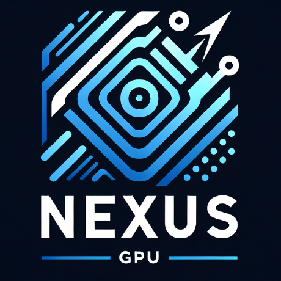

# Tensor Fusion

The Real-world GPU Virtualization Framework.

**Less GPUs, More AI Apps**.

## Documents

[![Contributors][contributors-shield]][contributors-url]
[![Forks][forks-shield]][forks-url]
[![Stargazers][stars-shield]][stars-url]
[![Issues][issues-shield]][issues-url]
[![MIT License][license-shield]][license-url]
[![LinkedIn][linkedin-shield]][linkedin-url]

 

  

  <h3 align="center">Tensor Fusion</h3>

  

    The Real-world GPU Virtualization Framework. <b>Less GPUs, More AI Apps.</b>
     
    <a href="https://docs.tensor-fusion.ai/"><strong>Explore the docs »</strong></a>
     
     
    <a href="https://docs.tensor-fusion.ai/guide/get-started">View Demo</a>
    ·
    <a href="https://github.com/NexusGPU/docs/issues/new?labels=bug&template=bug-report---.md">Report Bug</a>
    ·
    <a href="https://github.com/NexusGPU/docs/issues/new?labels=enhancement&template=feature-request---.md">Request Feature</a>
  

<!-- TABLE OF CONTENTS -->

  
Table of Contents

  <ol>
    <li>
      <a href="#about-the-project">About The Project</a>
      <ul>
        <li><a href="#built-with">Built With</a></li>
      </ul>
    </li>
    <li>
      <a href="#getting-started">Getting Started</a>
      <ul>
        <li><a href="#installation">Installation</a></li>
      </ul>
    </li>
    <li><a href="#usage">Usage</a></li>
    <li><a href="#roadmap">Roadmap</a></li>
    <li><a href="#contributing">Contributing</a></li>
    <li><a href="#license">License</a></li>
    <li><a href="#contact">Contact</a></li>
    <li><a href="#acknowledgments">Acknowledgments</a></li>
  </ol>

## About The Project

[![Product Name Screen Shot][product-screenshot]](https://example.com)

There are many great README templates available on GitHub; however, I didn't find one that really suited my needs so I created this enhanced one. I want to create a README template so amazing that it'll be the last one you ever need -- I think this is it.

Here's why:
* Your time should be focused on creating something amazing. A project that solves a problem and helps others
* You shouldn't be doing the same tasks over and over like creating a README from scratch
* You should implement DRY principles to the rest of your life :smile:

Of course, no one template will serve all projects since your needs may be different. So I'll be adding more in the near future. You may also suggest changes by forking this repo and creating a pull request or opening an issue. Thanks to all the people have contributed to expanding this template!

Use the `BLANK_README.md` to get started.

(<a href="#readme-top">back to top</a>)

### Built With

This section should list any major frameworks/libraries used to bootstrap your project. Leave any add-ons/plugins for the acknowledgements section. Here are a few examples.

* [![Next][Next.js]][Next-url]
* [![React][React.js]][React-url]
* [![Vue][Vue.js]][Vue-url]
* [![Angular][Angular.io]][Angular-url]
* [![Svelte][Svelte.dev]][Svelte-url]
* [![Laravel][Laravel.com]][Laravel-url]
* [![Bootstrap][Bootstrap.com]][Bootstrap-url]
* [![JQuery][JQuery.com]][JQuery-url]

## Getting Started

This is an example of how you may give instructions on setting up your project locally.
To get a local copy up and running follow these simple example steps.

### Installation

- [Installation on Kubernetes](https://docs.tensor-fusion.ai/guide/deployment-k8s)
- [Installation on Kubernetes](https://docs.tensor-fusion.ai/guide/deployment-k8s)

<!-- ## Usage

Use this space to show useful examples of how a project can be used. Additional screenshots, code examples and demos work well in this space. You may also link to more resources. -->

## Roadmap

### Core Features

- [x] NVIDIA GPU pooling
- [x] Pytorch support
- [ ] Seamless CUDA Context migration
- [ ] QoS levels
- [ ] Autoscaling policies
- [ ] TensorFlow and other framework support
- [ ] Compression, multiplexing & RDMA
- [ ] Support multiple GPU/NPU vendors based on [ZLUDA](https://github.com/vosen/ZLUDA)

### Scheduling & Management

- [ ] Metrics & tracing of CUDA calls
- [ ] Advanced scheduling such as MLFQ
- [ ] Hybrid scheduling, auto move communication intensive models back to GPU
- [ ] Management dashboard

### Platform Support

- [x] Run on VM/BareMetal
- [x] Run on Kubernetes clusters
- [ ] Run on ARM chips

See the [open issues](https://github.com/NexusGPU/docs/issues) for a full list of proposed features (and known issues).

## Contributing

Contributions are what make the open source community such an amazing place to learn, inspire, and create. Any contributions you make are **greatly appreciated**.

If you have a suggestion that would make this better, please fork the repo and create a pull request. You can also simply open an issue with the tag "enhancement".
Don't forget to give the project a star! Thanks again!

1. Fork the Project
2. Create your Feature Branch (`git checkout -b feature/AmazingFeature`)
3. Commit your Changes (`git commit -m 'Add some AmazingFeature'`)
4. Push to the Branch (`git push origin feature/AmazingFeature`)
5. Open a Pull Request

### Top contributors

(<a href="#readme-top">back to top</a>)

<!-- LICENSE -->
## License

TensorFusion is not open sourced as of now. It will be open after GA with BSL license.

## Support & Contact

- Discord channel: [https://discord.gg/2bybv9yQNk](https://discord.gg/2bybv9yQNk)
- Email address: [@support@tensor-fusion.com](mailto:support@tensor-fusion.com)
- Project link: [https://github.com/NexsusGPU/TensorFusion](https://github.com/NexsusGPU/TensorFusion)

## Acknowledgments

* [GPU Less](https://choosealicense.com)
* [rCUDA](https://www.webpagefx.com/tools/emoji-cheat-sheet)

(<a href="#readme-top">back to top</a>)

<!-- MARKDOWN LINKS & IMAGES -->
<!-- https://www.markdownguide.org/basic-syntax/#reference-style-links -->
[contributors-shield]: https://img.shields.io/github/contributors/NexusGPU/docs.svg?style=for-the-badge
[contributors-url]: https://github.com/NexusGPU/docs/graphs/contributors
[forks-shield]: https://img.shields.io/github/forks/NexusGPU/docs.svg?style=for-the-badge
[forks-url]: https://github.com/NexusGPU/docs/network/members
[stars-shield]: https://img.shields.io/github/stars/NexusGPU/docs.svg?style=for-the-badge
[stars-url]: https://github.com/NexusGPU/docs/stargazers
[issues-shield]: https://img.shields.io/github/issues/NexusGPU/docs.svg?style=for-the-badge
[issues-url]: https://github.com/NexusGPU/docs/issues
[license-shield]: https://img.shields.io/github/license/NexusGPU/docs.svg?style=for-the-badge
[license-url]: https://github.com/NexusGPU/docs/blob/master/LICENSE.txt
[linkedin-shield]: https://img.shields.io/badge/-LinkedIn-black.svg?style=for-the-badge&logo=linkedin&colorB=555
[linkedin-url]: https://linkedin.com/in/tensor-fusion
[product-screenshot]: images/screenshot.png