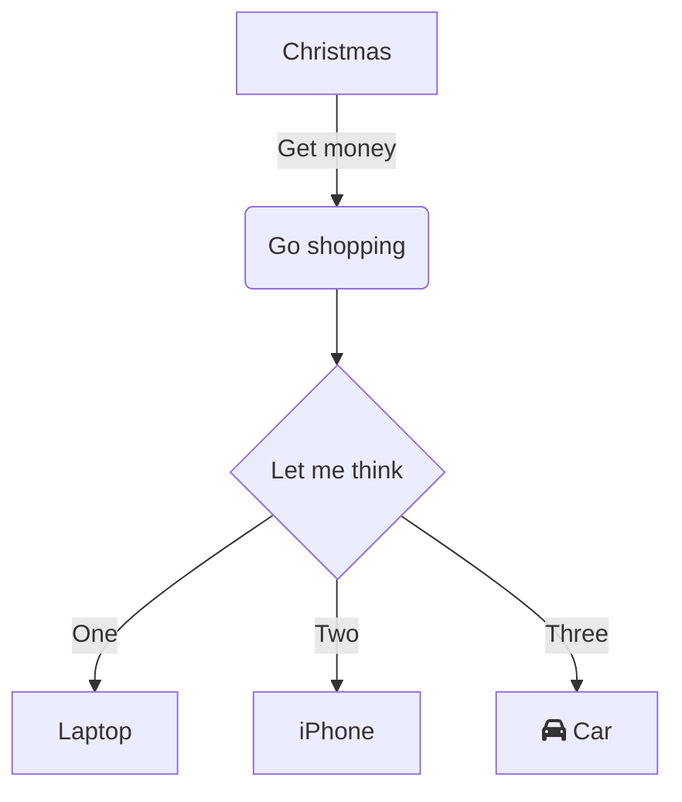
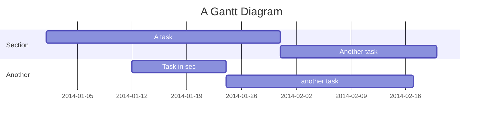
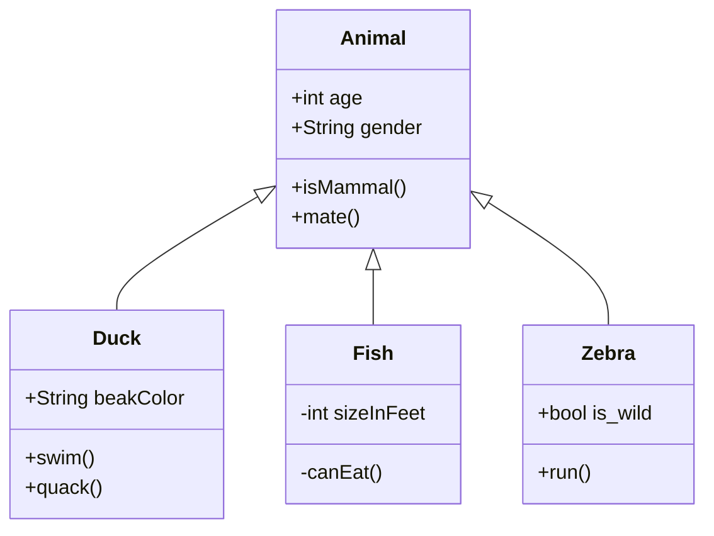
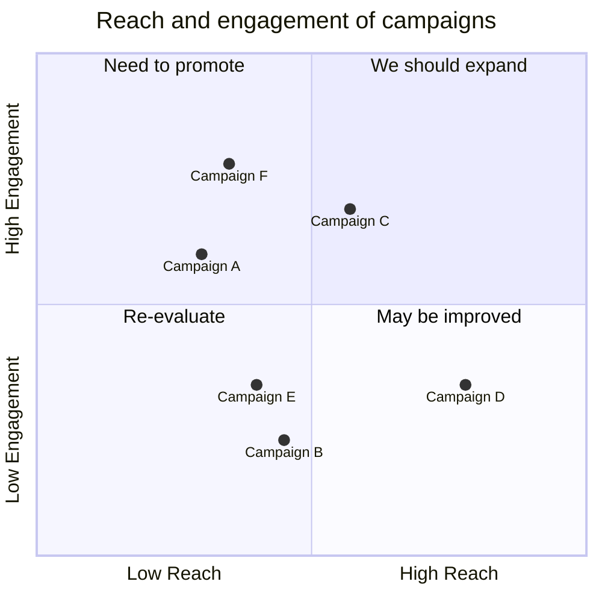

# Image Viewer
Click the image to zoom in and zoom out


# Sandpack Sandbox

::: sandbox {deps="vue3-toastify: latest, animate.css: ~4.1.1"}
```vue /src/App.vue
<script setup>
import "./style.css"
import { toast } from 'vue3-toastify';
import 'vue3-toastify/dist/index.css';

const notify = () => {
  toast.success(
    "Success Notification!",
    {
      position: toast.POSITION.BOTTOM_CENTER,
    },
  );
};
</script>

<template>
  <div>
    <button @click="notify">Notify !</button>
  </div>
</template>
```
```css /src/style.css{prefix=#readOnly/src/}
body {
  background-color: black;
}
```
:::


# Mermaid Examples










# Runtime API Examples

This page demonstrates usage of some of the runtime APIs provided by VitePress.

The main `useData()` API can be used to access site, theme, and page data for the current page. It works in both `.md` and `.vue` files:

```md
<script setup>
import { useData } from 'vitepress'

const { theme, page, frontmatter } = useData()
</script>

## Results

### Theme Data
<pre>{{ theme }}</pre>

### Page Data
<pre>{{ page }}</pre>

### Page Frontmatter
<pre>{{ frontmatter }}</pre>
```

<script setup>
import { useData } from 'vitepress'

const { site, theme, page, frontmatter } = useData()
</script>

## Results

### Theme Data
<pre>{{ theme }}</pre>

### Page Data
<pre>{{ page }}</pre>

### Page Frontmatter
<pre>{{ frontmatter }}</pre>

## More

Check out the documentation for the [full list of runtime APIs](https://vitepress.dev/reference/runtime-api#usedata).
