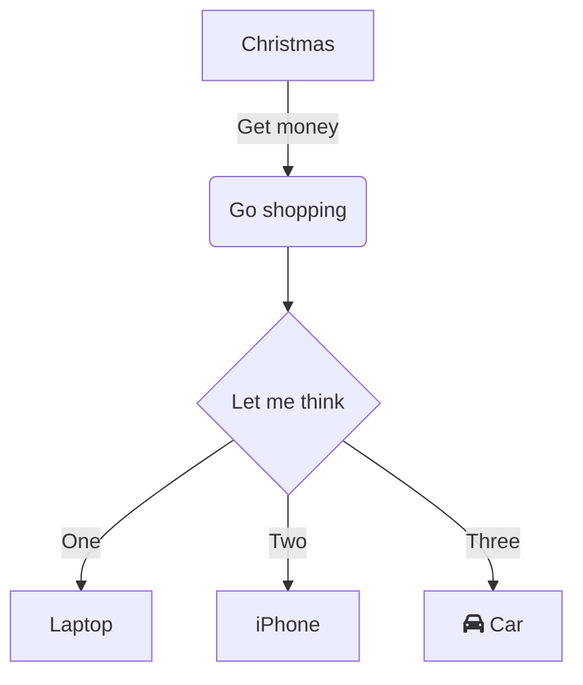
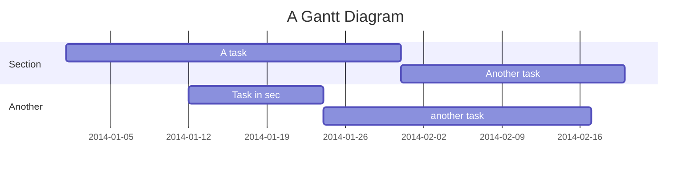
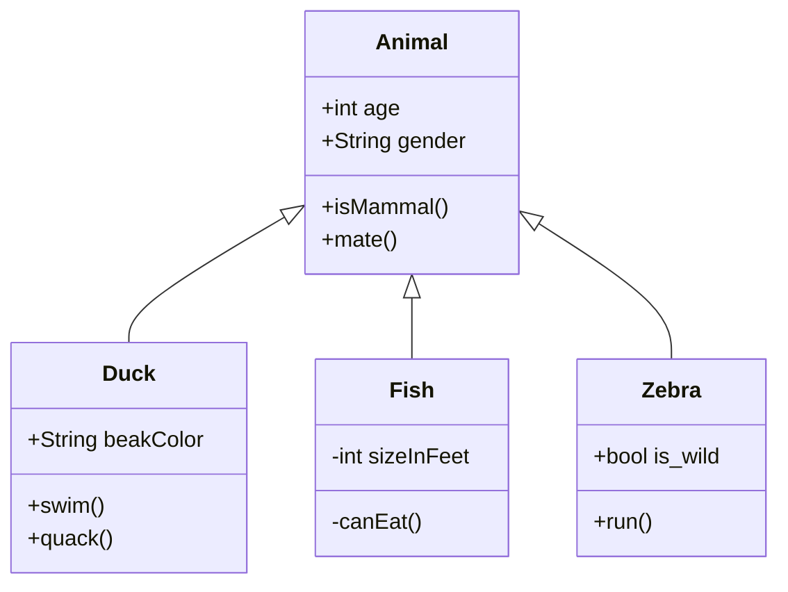
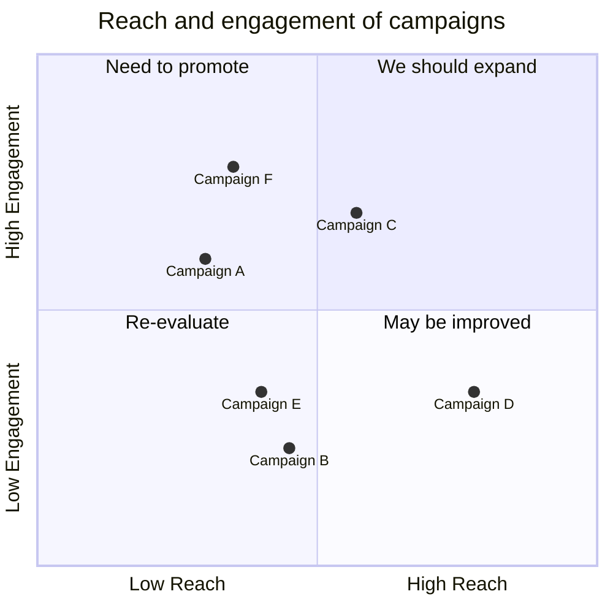

## Video.js

<video-player src="http://commondatastorage.googleapis.com/gtv-videos-bucket/sample/BigBuckBunny.mp4" poster="https://vitepress.dev/vitepress-logo-large.webp" />

## Image Viewer

Click the image to zoom in and zoom out

## Mermaid Examples

